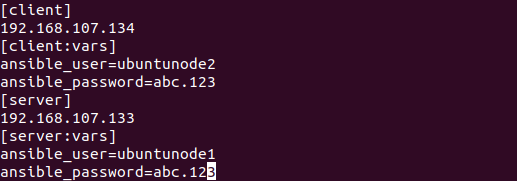
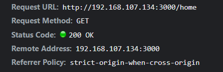

<!-- PROJECT LOGO -->
 

[![x][contributors-shield]][contributors-url]
[![Forks][forks-shield]][forks-url]
[![Stargazers][stars-shield]][stars-url]
[![Issues][issues-shield]][issues-url]
[![MIT License][license-shield]][license-url]

 
 
 

  

Parallel &amp; Distributed Computing 

  <h3 align="center">HPC Cluster Configuration</h3>

  

    This documentation will help you create a hpcc system on vmware.
     
    <a href="https://github.com/Elliott2100/Ansible_System_Administration_Project"><strong>Explore the docs »</strong></a>
     
     
    <a href="https://github.com/Elliott2100/Ansible_System_Administration_Project">Tutorial</a>
    ·
    <a href="https://github.com/Elliott2100/Ansible_System_Administration_Project">Softwares</a>
    ·
    <a href="https://github.com/Elliott2100/Ansible_System_Administration_Project">Issues</a>
  

Project Report

Section: BSCS 7A

By

[Syed Mustafa Imam][linkedin-url-mustafa]

[Syed Hurrar Hassan Rizvi][linkedin-url-hurrar]

[Elliott Franscis Joseph][linkedin-url-elliott]

[Hirdesh Kumar][linkedin-url-hirdesh]

 

---

Table of contents

[**1. Product Information**](#1-product-information) 

[**2. Use Cases**](#2-use-cases) 

[**3. Architecture**](#3-architecture) 

   - [**3.1. Application Communication**](#31-application-communication) 

   - [**3.2. Back-End Architecture**](#32Back-End-Architecture) 

   - [**3.3. Protocols And Uses**](#33-protocols-and-uses) 

[**4. Installation and configuration Snapshots**](#4installation-and-configuration-snapshots) 

   - [4.1.Master Node Configuration](#41master-node-configuration) 

   - [4.1.1. Now installing the Ansible on the Master node](#411-now-installing-the-ansible-on-the-master-node) 

   - [4.2. Node 1 Configuration](#42-node-1-configuration) 

   - [4.3. Node 2 Configuration](#43-Node-2-Configuration) 

[**5. Implementation**](#5-implementation) 

  -  [5.1 Ping The Nodes](#51-ping-the-nodes) 

  -  [5.2 Playbook For Deploying Client On Node2](#52-playbook-for-deploying-client-on-node2) 

  -  [5.3 Playbook For Deploying Server On Node1](#53-playbook-for-deploying-server-on-node1) 

  -  [5.4 Running ansible playbook for deploying server on Node1](#54-running-ansible-playbook-for-deploying-server-on-node1) 

  -  [5.5 Running ansible playbook for deploying client on Node2](#55-running-ansible-playbook-for-deploying-client-on-Node2) 

  -  [5.6 Node 1 is nodejsfileserver directory is created](#56-node-1-is-nodejsfileserver-directory-is-created) 

  -  [5.7 Node 2 is nodejsfileclient directory is created](#57-node-2-is-nodejsfileclient-directory-is-created) 

  -  [5.8 Scalaplex is running on 192.168.107.134 on 3000 port](#58-scalaplex-is-running-on-192.168.107.134-on-3000-port) 

  -  [5.9 Entering Credentials for Testing Purposes](#59-entering-credentials-for-testing-purposes) 

  -  [5.10 Server POST request is successful on port 5000](#510-server-POST-request-is-successful-on-port-5000) 

  -  [5.11 Client Side GET request for Admin portal](#511-client-side-get-request-for-admin-portal) 

  -  [5.12 Client side GET request successful for the movie list](#512-client-side-get-request-successful-for-the-movie-list]) 

[6. References](#6-References) 

# **1. Product Information**

Ansible is an open-source automation tool, or platform, used for IT tasks such as configuration management, application deployment, infraservice orchestration, and life cycle automation. Automation is crucial these days, with IT environments that are too complex and often need to manage scalability in order to balance load management, otherwise it will be difficult for system administrators to manually configure each machine of the server rack. It is agentless which means we can access all nodes or servers from a single node known as the master node without installing it on the other nodes. It is developed by using the Python programming language. Automation simplifies complex tasks, not just making developers&#39; jobs more manageable but allowing them to focus attention on other tasks that add value to an organization. In other words, it increases efficiency and time. It also gives you the power of deploying multi-tier applications. Ansible, as noted above, is rapidly rising to the top in the world of automation tools

# **2. Use Cases**

Ansible as a tool is used in various different applications and situations.

1. **Provisioning**

Provisioning is the process for creating a suitable environment for the application to have them running.

2. **Continuous Delivery**

Ansible provides a simple way to automatically deploy applications. All required services for deployment can be configured from a single system. Continuous Integration is a tool that can be used to run Ansible playbooks, this can be used to test and automatically deploy the application to production if tests are passed.

3. **Application Deployment**

Ansible provides a simple way to deploy applications across the infrastructure. Deployment of multi-tier applications can be simplified and the infrastructure can be easily changed over the course of time.

4. **Ansible for Cloud Computing**

Ansible makes it simple to arrange examples across all cloud suppliers. Ansible contains various modules and permits the administration of enormous cloud foundations across the public-private and half breed cloud.

5. **Ansible for Security and Compliance**

It can characterize security strategies which will computerize security strategies across all machines in the organization. Security jobs once arranged in an Ansible node will be installed across all machines in the organization automatically.

So, Ansible is a must if we are working in DevOps, IT Automation, and Cloud Infrastructure.

# **3. Architecture**

- **Inventory**

The Inventory is located at /etc/ansible/hosts file. It contains commands, modules, IP locations, and tasks for hosts and groups.

- **Playbook**

Playbooks are files written in YAML. Playbooks depict the task to be finished based on their definitions.

- **Modules**

Modules are script-like programs written to determine the ideal condition of the framework. These are written in a code editor. Modules are composed by the system administrator and executed through SSH. Ansible module is an independent script that can be utilized inside an Ansible Playbook.

## **3.1. Application Communication**

Ansible communicates with remote machines over the SSH protocol. By default,

it uses native OpenSSH and connects to remote machines using the current user name, just as SSH does. It works by associating with the machines on the network and pushing out Ansible modules to them. These projects are composed to be asset models of the ideal condition of the framework. Ansible then, at that point, executes these modules (over SSH naturally), and eliminates them when wrapped up. The library of modules can live on any machine, and there are no servers, daemons, or databases required. Typically, the work will be done on any terminal program, a text editor, or probably a version control system to keep track of changes on the content. Passwords are supported, but SSH keys with ssh-agent are one of the best ways to use Ansible.

## **3.2 Back-End Architecture**

##

In the Back-End Architecture of Ansible, the application operates on the basis of the playbook which is a YAML script created by the main system administrator that runs on the master node. The application uses SSH protocols to communicate with the target nodes from the master node. On executing the playbook, Ansible first gathers facts about the target nodes, by fact it means valuable information about the remote system, facts are stored in JSON format and are used in making important decisions about the tasks based on their statistics. The Playbook refers to the Inventory which has all the information regarding the nodes which group they belong to and what IP information feature. Ansible will perform operations on the remote machines according to the tasks scripted in the playbook. It is based on a Push Model, so it works by pushing out small programs called modules which will accomplish automation tasks.

## **3.3. Protocols And Uses**

The Protocols most used in Ansible is the SSH protocol. It can be extended to support other transport protocols such as SNMP or message bus by dropping a custom plugin into the connection_plugins directory. Connection plugins can be set globally in the ansible configuration.

# **4.Installation and configuration Snapshots**

## **4.1.Master Node Configuration**

###

###

###

###

###

### 

### 4.1.1. Now installing the Ansible on the Master node

- **Step 1: Update Your Master Node**

**#** It allows you to easily manage your distribution and independent software vendor software sources

- **Step 2: Install EPEL Repository**

**#** This allows for easy access to installed packages for commonly used software packages.

- **Step 3: Install Ansible**

**$** sudo apt-get update

**$** sudo apt-get install ansible -y

- **Step 4: Configure Our Node 1 &amp; 2 User for SSH Access**

**#** To enable SSH on the remote machines for that we use:

**$** sudo apt update

**$** sudo apt install openssh-server

**#** after installation the SSH service will automatically, to verify it we use:

**$** sudo systemctl status ssh

**#** The result should be **Active: active (running)**

- **Step 5: Create an Inventory**

**Ansible hosts file**

## **4.2. Node 1 Configuration**

## **4.3. Node 2 Configuration**

##

## **5. Implementation**

In this project we implemented the ansible on three virtual machines with Ubuntu 20.02 as the Operating System, one VM is the Master Node with username ubuntumaster and the other two VMs are Node1 with username ubuntunode1 and Node2 with username ubuntunode2 which are the target VM&#39;s.

We have made Node1 the Server Node and Node2 the Client Node. We installed all dependencies on both server and client which includes (git, curl, node, npm) packages. We deployed the playbooks to clone the git repository on node1 and node2 where node1 server side dependencies are installed through npm and node2 client side dependencies installed through yarn.

We did this to create a Three Tier Architecture where the client is hosted on Node1 and the server is hosted on Node2, after the playbook is executed the client is deployed on Node 2 and the server is deployed on Node 1. The client communicates with the server through port 5000 where the backend services are active and running on Node1 and client is sending GET and POST requests on the port to access the services, a REST API is established. This service is also accessible through the ip address of the server machine .This all set through the ansible hosts file which can be found on the masternde within the /etc/ansible directory.

## **5.1 Ping The Nodes**

## **5.2 Playbook For Deploying Client On Node2**

## **5.3 Playbook For Deploying Server On Node1**

## **5.4 Running ansible playbook for deploying server on Node1**

##

## **5.5 Running ansible playbook for deploying client on Node2**

## **5.6 Node 1 is nodejsfileserver directory is created**

## **5.7 Node 2 is nodejsfileclient directory is created**

## **5.8 Scalaplex is running on 192.168.107.134 on 3000 port**

##

## **5.9 Entering Credentials for Testing Purposes**

##

##

## **5.10 Server POST request is successful on port 5000**

## **5.11 Client Side GET request for Admin portal**

## **5.12 Client side GET request successful for the movie list**

## **6. References**

- [https://www.ansible.com/contact-us?hsCtaTracking=c179b300-92c4-4bf9-b035-11fe8e147b3e%7Cd89a6445-6b7c-4d68-ab2e-aad1f4ab567f](https://www.ansible.com/contact-us?hsCtaTracking=c179b300-92c4-4bf9-b035-11fe8e147b3e%7Cd89a6445-6b7c-4d68-ab2e-aad1f4ab567f)
- [https://docs.ansible.com/ansible/latest/index.html](https://docs.ansible.com/ansible/latest/index.html)
- [https://www.youtube.com/watch?v=5hycyr-8EKs](https://www.youtube.com/watch?v=5hycyr-8EKs)
- [https://medium.com/nonstopio/deploying-a-node-js-app-using-ansible-cfe7dfeddcac](https://medium.com/nonstopio/deploying-a-node-js-app-using-ansible-cfe7dfeddcac)
- [https://docs.ansible.com/ansible/latest/plugins/connection.html](https://docs.ansible.com/ansible/latest/plugins/connection.html)

---

[contributors-shield]: https://img.shields.io/github/contributors/othneildrew/Best-README-Template.svg?style=for-the-badge
[contributors-url]: https://github.com/SyedMustafaImam/HPCC-On-VMware-/graphs/contributors
[forks-shield]: https://img.shields.io/github/forks/othneildrew/Best-README-Template.svg?style=for-the-badge
[forks-url]: https://github.com/SyedMustafaImam/HPCC-On-VMware-/network/members
[stars-shield]: https://img.shields.io/github/stars/othneildrew/Best-README-Template.svg?style=for-the-badge
[stars-url]: https://github.com/SyedMustafaImam/HPCC-On-VMware-/stargazers
[issues-shield]: https://img.shields.io/github/issues/othneildrew/Best-README-Template.svg?style=for-the-badge
[issues-url]: https://github.com/SyedMustafaImam/HPCC-On-VMware-/issues
[license-shield]: https://img.shields.io/github/license/othneildrew/Best-README-Template.svg?style=for-the-badge
[license-url]: https://github.com/SyedMustafaImam/HPCC-On-VMware-/blob/master/LICENSE.txt
[linkedin-shield]: https://img.shields.io/badge/-LinkedIn-black.svg?style=for-the-badge&logo=linkedin&colorB=555
[linkedin-url]: https://linkedin.com/in/othneildrew
[product-screenshot]: images/screenshot.png
[linkedin-url-mustafa]: https://linkedin.com/in/syedmustafaimam
[linkedin-url-elliott]: https://www.linkedin.com/in/elliott-joseph-6436411ab/
[linkedin-url-hirdesh]: https://www.linkedin.com/in/hirdeshkumar2407/
[linkedin-url-hurrar]: https://www.linkedin.com/in/syedhurrarhasanrizvi/
[product-screenshot]: images/screenshot.png
